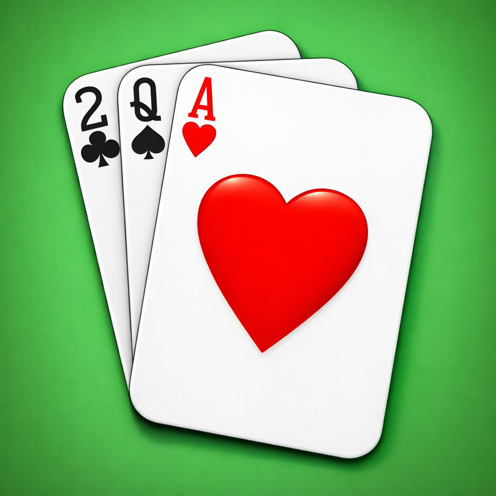

# Hearts Scoreboard

<p align="center">
  
</p>

A simple Hearts Scoreboard for iOS/iPadOS, written mostly by Cursor in SwiftUI. This was recently refreshed after about 10 years.

## 2026 Refresh

This repo was revived and modernized using Cursor. Some of the biggest changes:

- **Cleaned up project structure**: Removed old cruft and made it an easy-to-open SwiftUI project again.
- **3–6 player support**: Flexible layout that works nicely for different table sizes.
- **Game History**: A simple history view so you can look back at past hands and results.

## Screenshots

### iPhone (iOS)

<p align="center">
  
  &nbsp;
  
  &nbsp;
  
</p>

<p align="center">
  
  &nbsp;
  
</p>

### iPad (iPadOS)

<p align="center">
  
  &nbsp;
  
  &nbsp;
  
</p>

<p align="center">
  
  &nbsp;
  
</p>

## Generate and open the project

From this directory:

```bash
xcodegen generate
open HeartsScoreboard.xcodeproj
```

## Legacy Screenshots

These screenshots show what HeartsScoreboard looked like prior to the 2026 refresh.

<p align="center">
  
  
  
</p>

